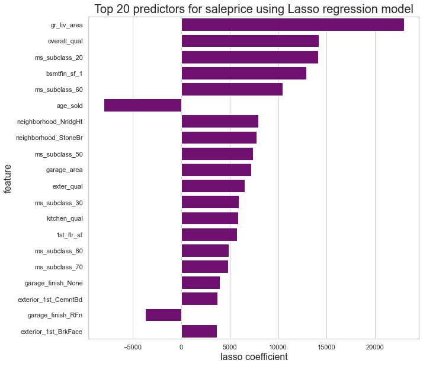

# Project 2: Predicting Housing Prices in Ames, Iowa

This project aims to assist property agents in Ames, Iowa to provide better advice to their clients who would like to buy/sell housing properties in the city. 

After an in-depth analysis of the a comprehensive datasets on houses in Ames/Iowa sold between 2006 and 2010, we tested several linear regression models to seek out the best model that could predict housing prices in the city. 
The model also informs us on the best predictors of housing prices i.e. the key features of the house/environment affect housing prices. 

## Problem Statement

   We are a team of data-driven property agents in Ames, Iowa. 

   We would like to generate insights from housing data in providing better advice to their clients, instead of relying merely on gut feel. 

   The model will  provide a real gauge of housing prices based on key features, which can we draw reference from when we are advising clients looking at buying/selling their homes.  

   Some of the questions that homeowners often have include:
  *  Q1. What is the best price for me to sell or buy a particular house? 
  *  Q2.What features of the house are more important in determining house price?
  *  Q3. Are there any features that I can do to enhance the attractiveness of my house before selling it? 
    
We evaluated the success of the models based on:
*  R2 score (the closer to 1, the better) and
*  RMSE score (the lower, the better) 
## Data Documentation

Please refer to the following page for a comprehensive documentation of the data available in the Ames housing dataset:
[Source.
](http://jse.amstat.org/v19n3/decock/DataDocumentation.txt
)

## Structure

This project is organised into two notebooks: 

* Notebook 1 : Exploratory Data Analysis & Data Cleaning
* Notebook 2: Data Preprocessing & Modelling

## Summary of Analysis

The lasso regression model was the best performing model, produced an R2 score of 0.887 and RMSE of 28447 on the validation set. 

The comparison of R2 and RMSE scores are as follows: 

| Method | R2 Score | RMSE Score |Evaluation|
| :-: | :-: | :-: | :-:|
| Baseline Model - Train | 0.0 | 76792.22| Baseline|
|Baseline Model - Val | -0.00160 | 84854.98 | Baseline|
| Lasso Regression - Train | 0.90058 | 24213.20 | Best|
| Lasso Regression - Val | 0.88719 | 28477.41 | Best|
| Ridge Regression - Train | 0.90245 | 23983.78 |Second Best|
| Ridge Regression - Val | 0.88562 | 28673.88 |Second Best|
| Linear Regression - Train | 0.90286 | 23933.28 |Poor|
| Linear Regression - Val | -2.51928e+20 | 1345762277693973.2 |Poor|

The most significant predictors of housing prices are as follows:

   

## Conclusions & Recommendations

Our property agents in the city can advise their clients on the following: 

* Homeowners should regularly maintain the overall  quality and condition of their house; either though regular repair/maintenance work to their interior or exterior features. 
* The age of a house does not have as big an impact on the housing price, as the overall house quality. 
* Houses in certain neighborhoods such as NridgHt and StoneBr seem to fetch a higher price. (Further research is required to determine if external, environmental factors contributed to this.)
* Having and maintaining an excellent kitchen goes a long way in ensuring a good selling price. 

## Limitations & Next Steps

* The datasets is dated; it must be refreshed to understand changes in housing prices trends in the last decade since the dataset was released. 
* The data collection process led to many incomplete data which affects the accuracy of the data and our model. For future iterations, data collection should be controlled and performed more decisively. 
* The data collection on qualitative information e.g. ranking of overall condition or quality of a house should have be defined with greater specificity for us to glean more useful insights from the data. 

**Possible Improvements**
* To address the right-skewedness of sale price distribution by normalizing it. 
* To explore other hyperparameter tuning methods to improve the R2 and RMSE scores of lasso regression. 
* To use the top predictors identified in Lasso regression and re-fit this subset data on the selected model. 
